# JOBSHEET 6 - PEMILIHAN 2

**Identitas Mahasiswa:**
* **Nama:** Muhammad Akbar
* **NIM:** 264107020029 
* **Kelas / No. Presensi:** 1D/21

---

## 1: TUJUAN PRAKTIKUM

Berikut adalah tujuan pelaksanaan praktikum pada bab ini:

1. Mahasiswa mampu menyelesaikan permasalahan/studi kasus menggunakan sintaks pemilihan bersarang
2. Mahasiswa mampu menerapkan sintaks pemilihan bersarang ke dalam program Java
3. Mahasiswa mampu menerapkan operator logika &&, ||, dan ! pada struktur pemilihan

---

## 2: HASIL PERCOBAAN & ANALISIS
### 2.1 Percobaan 1: Nested IF untuk Mengecek Syarat Ujian Skripsi 

Seorang mahasiswa akan mendaftar ujian skripsi. Sistem SIMTA akan memeriksa syarat administrasi terlebih dahulu, yaitu mahasiswa harus bebas kompen. Jika syarat ini terpenuhi, sistem kemudian memeriksa catatan log bimbingan. Untuk bisa mendaftar ujian, mahasiswa harus memiliki minimal 8 kali bimbingan dengan pembimbing 1 dan minimal 4 kali bimbingan dengan pembimbing 2. Jika semua syarat terpenuhi, mahasiswa dapat melanjutkan ke proses pendaftaran ujian skripsi. Jika tidak, sistem akan menampilkan alasan kegagalan.

#### 2.1.1 Kode Program Java
```java
import java.util.Scanner;

public class nestedUjianSkripsi21 {
    public static void main(String[] args) {
        Scanner sc = new Scanner(System.in);
        
        String pesan;
        System.out.print("Apakah mahaiswa sudah bebas kompen? (Ya/Tidak): ");
        String bebasKompen = sc.nextLine().trim();
        System.out.print("Masukkan jumlah log bimbingan Pembimbing 1: ");
        int bimbinganP1 = sc.nextInt();
        System.out.print("Masukkan jumlah log bimbingan Pembimbing 2: ");
        int bimbinganP2 = sc.nextInt();

        if (bebasKompen.equalsIgnoreCase("Ya")) {
            if (bimbinganP1 >= 8 && bimbinganP2 >=4) {
                pesan= "Semua syarat terpenuhi. Mahasiswa boleh mendaftar ujian skripsi";
            } else if (bimbinganP1 < 8 && bimbinganP2 < 4) {
                pesan = "Gagal! Log bimbingan P1 kurang dari 8 kali dan P2 kurang dari 4 kali";
            } else if (bimbinganP1 < 8){
                pesan = "Gagal! Log bimbingan P1 belum mencapai 8 kali";
            } else {
                pesan = "Gagal! Log bimbingan P2 belum mecapai 4 kali";
            }
        } else {
            pesan = "Gagal! Mahasiswa masih memiliki tanggungan kompen";
        }
        System.out.println(pesan);
    }
}
```

#### 2.1.2 Hasil Running / Screenshot Output
Berikut adalah contoh tampilan *output* setelah program dijalankan:

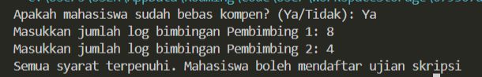

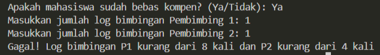

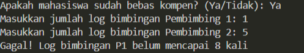

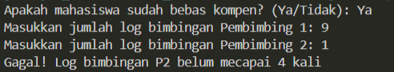

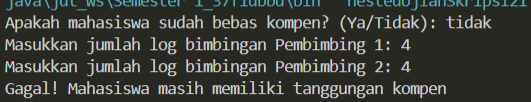

#### 2.1.3 Jawaban Pertanyaan / Pertanyaan Refleksi
* **Pertanyaan 1:** Apa yang terjadi jika mahasiswa menjawab `No` pada pertanyaan bebas kompen?
Mengapa demikian?
  * **Jawab:** Jika menjawab `No` maka yang dirun adalah blok `else` yaitu pernyataan `"pesan = Gagal! Mahasiswa masih memiliki tanggungan kompen"` . Hal tersebut dikarenakan kondisi `if` adalah `(bebasKompen.equalsIgnoreCase("Ya"))` sehingga jika diinput selain `ya` di bebasKompen maka akan dianggap false sehingga yang dirun adalah blok `else`.
  Hasil run: 

  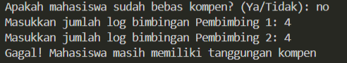
  
* **Pertanyaan 2:** Jelaskan maksud dari potongan kode berikut! ```if (bimbinganP1 >= 8 && bimbinganP2 >=4) {```
  * **Jawab:** Maksud dari potongan kode tersebut adalah blok itu akan di run jika bimbingan pembimbing 1 adalah minimal 8 kali dan bimbingan pembimbing 2 minimal 4 kali, sehingga jika salah satu kondisi tersebut tidak terpenuhi maka tidak akan dijalankan pernyatannya.
* **Pertanyaan 3:** Bagaimana alur pemeriksaan syarat mahasiswa dari awal sampai akhir? Jelaskan secara runtut untuk semua kondisi!
  * **Jawab:** 
  1\. Dicek apakah mahasiswa bebas kompen atau tidak, Jika iya maka akan dilanjutkan ke pengecekan kedua, jika tidak maka akan dijalankan pesan dari blok else yaitu `"Gagal! Mahasiswa masih memiliki tanggungan kompen"`.
  2\.  Dicek apakah mahasiswa sudah melakukan bimbingan pembimbing 1 sebanyak minimal 8 kali dan bimbingan pembimbing 2 minimal 4 kali. Jika iya maka akan dijalankan pesan `"Semua syarat terpenuhi. Mahasiswa boleh mendaftar ujian skripsi"`. Jika salah satu tidak mencukupi minimal jumlah bimbingan maka akan dilakukan pengecekan selanjutnya.
  3\. Dicek apakah mahasiswa melakukan bimbingan pembimbing 1 kurang dari 8 kali dan bimbingan pembimbing 2 kurang dari 4 kali. Jika keduanya benar, makan akan dijalankan pesan `"Gagal! Log bimbingan P1 kurang dari 8 kali dan P2 kurang dari 4 kali"`. Jika tidak maka akan dilakukan pengecekan selanjutnya.
  4\.Dicek apakah mahasiswa melakukan bimbingan pembimbing 1 kurang dari 8 atau tidak. Jika kurang dari 8 maka akan dijalankan pesan `"Gagal! Log bimbingan P1 belum mencapai 8 kali"`. Jika bimbingan pembimbing 1 tidak kurang dari 8 maka akan dijalankan pesan dari blok else yaitu `"Gagal! Log bimbingan P2 belum mecapai 4 kali"`.

---
### 2.2 Percobaan 2: Operator Logika untuk Menentukan Akses WiFi Kampus 

Sistem WiFi kampus hanya dapat digunakan oleh mahasiswa atau dosen yang akunnya tidak diblokir. Program menerima informasi apakah pengguna merupakan mahasiswa, dosen, dan  apakah  akun  pengguna  sedang  diblokir.  Akses  diberikan  apabila  pengguna  merupakan mahasiswa  atau  dosen,  dan  akun  pengguna  tidak  diblokir.  Percobaan  ini  digunakan  untuk mempraktikkan operator logika `&&` (AND), `||` (OR), dan `!` (NOT). 

#### 2.2.1 Kode Program Java
```java
import java.util.Scanner;

public class operatorLogikaWifi21 {
    public static void main(String[] args) {
        Scanner sc = new Scanner(System.in);

        boolean mahasiswa;
        boolean dosen;
        boolean akunDiblokir;

        System.out.print("Apakah pengguna mahasiswa? (true/false): ");
        mahasiswa = sc.nextBoolean();
        System.out.print("Apakah pengguna dosen? (true/false): ");
        dosen = sc.nextBoolean();
        System.out.print("Apakah akun sedang diblokir? (true/false): ");
        akunDiblokir = sc.nextBoolean();

        if ((mahasiswa || dosen) && !akunDiblokir) {
            System.out.println("Akses Wifi diberikan");
        } else {
            System.out.println("Akses Wifi ditolak");
        }
    }
}
```

#### 2.2.2 Hasil Running / Screenshot Output
Compile dan run program. Uji program menggunakan beberapa kombinasi masukan
berikut dan amati hasilnya.
| Uji | mahasiswa | dosen | akunDiblokir |
| :---: | :--- | :--- | :---: |
| 1 | true | false | false |
| 2 | false | true | false |
| 3 | true | false | true |
| 4 | false | false | false |

Hasil uji 1: 
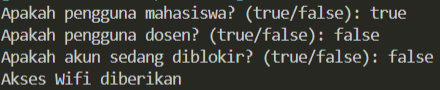

Hasil uji 2:
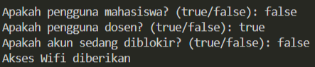

Hasil uji 3:
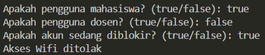

Hasil uji 4: 
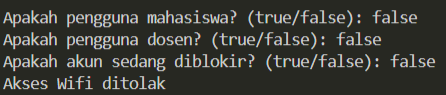


#### 2.2.3 Jawaban Pertanyaan / Pertanyaan Refleksi
* **Pertanyaan 1:** Jelaskan fungsi operator `||`, `&&`, dan `!` pada kondisi program tersebut.
  * **Jawab:** Fungsi operator `||` dalam program tersebut adalah jika ada minimal salah satu variabel bernilai `true` maka kondisi tersebut `true`, karena dosen dan mahasiswa sama-sama civitas akademika yang berhak mengakses wifi.
  Fungsi operator `&&` dalam program tersebut adalah jika kedua kondisi tersebut bernilai `true` maka hasilnya `true`, dalam program tersebut `&&` digunakan untuk mengecek apakah akunnya diblokir atau tidak, jika diblokir maka dosen atau mahasiswa tidak dapat mengakses wifi.
  Fungsi operator `!` pada program tersebut adalah untuk menegasi variabel `akunDiblokir`, karena yang perlu dicek adalah apakah akun sedang tidak diblokir, sehingga variabel `akunDiblokir` perlu dinegasi menjadi `!akunDiblokir`.
* **Pertanyaan 2:** Mengapa pengguna dosen tetap dapat memperoleh akses ketika nilai mahasiswa = `false`?
  * **Jawab:** Karena operator yang digunakan adalah `||`, jadi hanya cukup salah satu saja yang nilainya `true` maka nilai `(mahasiswa || dosen)` sudah pasti true. Oleh karena itu, jika pengguna Dosen(`true`) maka tetap memperoleh akses.
* **Pertanyaan 3:** Ubah operator `||` menjadi `&&`. Jalankan kembali program menggunakan data uji 1 dan 2. Apa yang terjadi dan mengapa?
  * **Jawab:** 
  Kode: 
  ```java
  import java.util.Scanner;

    public class operatorLogikaWifi21 {
        public static void main(String[] args) {
            Scanner sc = new Scanner(System.in);

            boolean mahasiswa;
            boolean dosen;
            boolean akunDiblokir;

            System.out.print("Apakah pengguna mahasiswa? (true/false): ");
            mahasiswa = sc.nextBoolean();
            System.out.print("Apakah pengguna dosen? (true/false): ");
            dosen = sc.nextBoolean();
            System.out.print("Apakah akun sedang diblokir? (true/false): ");
            akunDiblokir = sc.nextBoolean();

            if ((mahasiswa && dosen) && !akunDiblokir) {
                System.out.println("Akses Wifi diberikan");
            } else {
                System.out.println("Akses Wifi ditolak");
            }
        }
    }
  ``` 
  Yang terjadi(hasil):

  Data uji 1:
  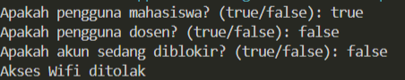

  Data uji 2:
  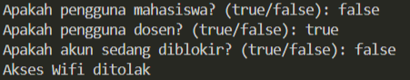

* **Pertanyaan 4:** Pada ekspresi ```mahasiswa || dosen```, kapan kondisi dosen tidak perlu dievaluasi? Jelaskan berdasarkan short-circuit evaluation.
  * **Jawab:** Kondisi dosen tidak perlu dievaluasi ketika variabel mahasiswa bernilai `true`, berdasarkan short-circuit evaluation jika menggunakan operator `||` dan variabel pertama bernilai `true` maka kondisi kedua tidak dievaluasi karena sudah pasti hasilnya `true`.
* **Pertanyaan 5:** Pada ekspresi ```(mahasiswa || dosen) && !akunDiblokir```, kapan kondisi `!akunDiblokir` tidak perlu dievaluasi? Jelaskan.
  * **Jawab:** Pada ekspresi ```(mahasiswa || dosen) && !akunDiblokir``` kondisi `!akunDiblokir` tidak perlu dievaluasi ketika kondisi ```(mahasiswa || dosen)``` adalah `false`, berdasarkan short-circuit evaluation jika menggunakan operator `&&` dan kondisi pertama adalah `false` maka ekspresi tersebut sudah pasti `false` sehingga kondisi kedua tidak perlu dievaluasi. 

---
### 2.3 Percobaan 3: Nested IF dan Operator Logika untuk Menentukan Akses Laboratorium

Mahasiswa dapat menggunakan laboratorium di luar jadwal kuliah apabila statusnya aktif dan tidak sedang mendapatkan sanksi. Jika syarat tersebut terpenuhi, sistem melakukan pemeriksaan kedua. Akses laboratorium diberikan apabila mahasiswa memiliki izin dosen atau merupakan asisten laboratorium. Kasus ini menggabungkan pemilihan bersarang dengan operator logika.

#### 2.3.1 Kode Program Java
```java
import java.util.Scanner;

public class nestedAksesLab21 {
    public static void main(String[] args) {
        Scanner sc = new Scanner (System.in);

        boolean mahasiswaAktif;
        boolean sedangDisanksi;
        boolean punyaIzinDosen;
        boolean asistenLab;

        System.out.println("Apakah mahasiswa aktif? (true/false): ");
        mahasiswaAktif = sc.nextBoolean();
        System.out.println("Apakah mahasiswa sedang disanksi? (true/false): ");
        sedangDisanksi = sc.nextBoolean();
        System.out.println("Apakah mahasiswa punya izin dosen? (true/false): ");
        punyaIzinDosen = sc.nextBoolean();
        System.out.println("Apakah mahasiswa asisten lab? (true/false): ");
        asistenLab = sc.nextBoolean();

        if (mahasiswaAktif && !sedangDisanksi) {
            if (punyaIzinDosen || asistenLab) {
                System.out.println("Akses laboratorium diberikan");
            } else {
                System.out.println("Akses ditolak: membutuhkan izin dosen atau status asisten lab");
            }
        } else {
            System.out.println("Akses ditolak: status mahasiswa tidak memenuhi syarat");
        }
    }
}
```

#### 2.3.2 Hasil Running / Screenshot Output

Berikut adalah contoh tampilan *output* setelah program dijalankan:

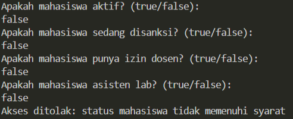

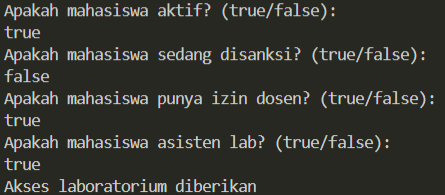

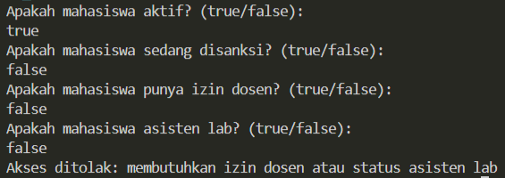

#### 2.3.3 Jawaban Pertanyaan / Pertanyaan Refleksi
* **Pertanyaan 1:** Mengapa pemeriksaan ```punyaIzinDosen || asistenLab``` ditempatkan di dalam IF pertama?
  * **Jawab:** Karena setelah mengecek apakah mahasiswa tersebut aktif dan tidak sedang disanksi yang perlu dicek selanjutnya adalah apakah mahasiswa tersebut punya izin dosen atau dia merupakan asisten lab. Jadi, ```punyaIzinDosen || asistenLab``` hanya akan dijalankan ketika mahasiswa tersebut aktif dan tidak sedang disanksi.
* **Pertanyaan 2:** Jelaskan fungsi operator `&&`, `||`, dan `!` pada program tersebut.
  * **Jawab:** Fungsi operator `&&` adalah jika kedua kondisi tersebut bernilai `true` maka hasilnya `true`, dalam program tersebut `&&` digunakan untuk mengecek kondisi apakah mahasiswa tersebut aktif dan tidak sedang disanksi jika `true` maka akan dilakukan pengecekan selanjutnya.
  Fungsi operator `||` adalah jika ada minimal salah satu variabel bernilai `true` maka kondisi tersebut `true`, dalam program tersebut operator `||` digunakan untuk mengecek apakah mahasiswa tersebut punya izin dosen atau merupakan asisten lab, jika salah satu `true` maka dia diberikan akses lab. 
  Fungsi operator `!` pada program tersebut adalah untuk menegasi variabel `sedangDisanksi`, karena yang perlu dicek adalah apakah mahasiswa sedang tidak disanksi, sehingga variabel `sedangDisanksi` perlu dinegasi menjadi `!sedangDisanksi`.
* **Pertanyaan 3:** Apakah syarat akses dapat ditulis menjadi satu kondisi: ```mahasiswaAktif && !sedangDisanksi && (punyaIzinDosen || asistenLab)```? Jelaskan apakah keputusan akses akhirnya sama.
  * **Jawab:** Bisa, dan keputusan aksesnya tetap sama. Hal yang membedakan adalah output saat percabangan yaitu `membutuhkan izin dosen atau status asisten lab` tidak ada jika ditulis menjadi satu kondisi saja. Oleh karena itu jika ditulis menjadi satu kondisi maka program hanya mempunyai satu else saja sehingga tidak dapat memberi tahu alasan bisa `false` dan dimanakah letak `false` yang menyebabkan akses tidak diberikan.
  Kode:
  ```java
  import java.util.Scanner;
    public class nestedAksesLab21Soal {
        public static void main(String[] args) {
            Scanner sc = new Scanner (System.in);

            boolean mahasiswaAktif;
            boolean sedangDisanksi;
            boolean punyaIzinDosen;
            boolean asistenLab;

            System.out.println("Apakah mahasiswa aktif? (true/false): ");
            mahasiswaAktif = sc.nextBoolean();
            System.out.println("Apakah mahasiswa sedang disanksi? (true/false): ");
            sedangDisanksi = sc.nextBoolean();
            System.out.println("Apakah mahasiswa punya izin dosen? (true/false): ");
            punyaIzinDosen = sc.nextBoolean();
            System.out.println("Apakah mahasiswa asisten lab? (true/false): ");
            asistenLab = sc.nextBoolean();

            if (mahasiswaAktif && !sedangDisanksi && (punyaIzinDosen || asistenLab)) {
                System.out.println("Akses laboratorium diberikan");
            } else {
                System.out.println("Akses ditolak: status mahasiswa tidak memenuhi syarat");
            }
        }
    }
  ``` 
  Hasil run: 

  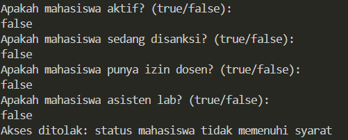

  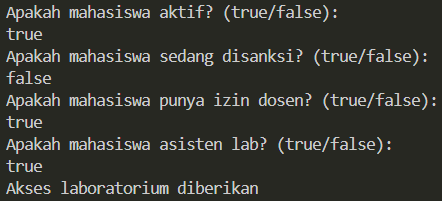

  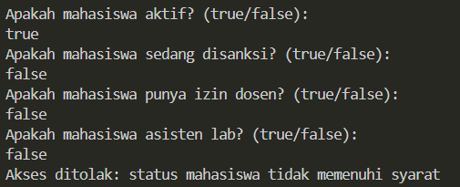
  
* **Pertanyaan 4:** Apa keuntungan menggunakan Nested IF pada kasus ini dibandingkan hanya satu `IF` jika sistem perlu menampilkan alasan penolakan yang berbeda?
  * **Jawab:** Keuntungan menggunakan nested IF pada kasus ini adalah dapat mengetahui alasan spesifik mengapa mahasiswa tersebut tidak mendapatkan akses lab. Dengan begitu, mahasiswa mengetahui secara pasti alasan aksesnya ditolak.
* **Pertanyaan 5:** Buat satu kombinasi masukan yang menyebabkan akses ditolak pada level pertama dan satu kombinasi yang menyebabkan akses ditolak pada level kedua.
  * **Jawab:**
  Kombinasi masukan yang menyebabkan akses ditolak pada level pertama :
  false-false-false-false

  

  Kombinasi masukan yang menyebabkan akses ditolak pada level kedua :
  true-false-false-false

  

## 3: TUGAS MANDIRI

Berikut adalah daftar tugas yang dikerjakan pada Jobsheet ini:

- [x] **Tugas 1:** Membuat program Java untuk diskon toko buku (wajib menerapkan nested if)
- [x] **Tugas 2:** Membuat program Java untuk sistem seleksi calon asisten praktikum menggunakan nested if

### 3.1 Implementasi Kode Tugas
#### Tugas 1 - Diskon Toko Buku
```java
import java.util.Scanner;

public class tugas1DiskonTokoBuku {
    public static void main(String[] args) {
        Scanner sc = new Scanner(System.in);

        String hari;
        String jenisBuku;
        int jumlahBuku;
        String diskon;

        System.out.println("---Diskon Toko Buku---");
        System.out.print("Masukkan hari (Senin/Selasa/Rabu/Kamis/Jumat/Sabtu/Minggu): ");
        hari = sc.nextLine();

        if (hari.equalsIgnoreCase("rabu")) {
            System.out.print("Masukkan jenis buku (kamus/novel/lainnya): ");
            jenisBuku = sc.nextLine();
            System.out.print(String.format("Masukkan jumlah %s yang dibeli: ",jenisBuku));
            jumlahBuku = sc.nextInt();
            if (jenisBuku.equalsIgnoreCase("kamus")) {
                if (jumlahBuku > 2) {
                    diskon = "Diskon adalah 12%";
                } else {
                    diskon = "Diskon adalah 10%";
                }
            } else if (jenisBuku.equalsIgnoreCase("novel")) {
                if (jumlahBuku > 3){
                    diskon = "Diskon adalah 9%";
                } else {
                    diskon = "Diskon adalah 8%";
                }
            } else {
                if (jumlahBuku > 3) {
                    diskon = "Diskon adalah 5%";
                } else {
                    diskon = "Tidak ada diskon, pembelian buku kurang dari 4";
                } 
            }
        } else {
            diskon = "Tidak ada diskon di hari selain rabu";
        }
        System.out.println("---Total Diskon---\n"+diskon);
    }
}
```
#### Tugas 2 - Seleksi Calon Asisten Praktikum
```java
import java.util.Scanner;

public class tugas2SeleksiAsisten21 {
    public static void main(String[] args) {
        Scanner sc = new Scanner(System.in);

        boolean aktif;
        boolean sanksi;
        boolean sertif;
        byte nilaiDaspro;
        byte nilaiWawancara;
        String pesan;

        System.out.println("---Seleksi Asisten Praktikum Dasar Pemograman---");
        System.out.print("Apakah mahasiswa berstatus aktif? (true/false): ");
        aktif = sc.nextBoolean();

        if (aktif) {
            System.out.print("Apakah mahasiswa sedang mendapatkan sanksi akademik? (true/false): ");
            sanksi = sc.nextBoolean();
            if (!sanksi) {
                System.out.print("Apakah memiliki sertifikat kompetensi pemrograman? (true/false): ");
                sertif = sc.nextBoolean();
                System.out.print("Masukkan nilai dasar pemograman: ");
                nilaiDaspro = sc.nextByte();
                if (nilaiDaspro >= 80 || sertif) {
                    System.out.print("Masukkan nilai wawancara: ");
                    nilaiWawancara = sc.nextByte();
                    if (nilaiWawancara >= 75) {
                        pesan = "Selamat, anda diterima menjadi asisten praktikum";
                    } else {
                        pesan = "Anda ditolak karena nilai wawancara kurang dari 75";
                    }
                } else {
                    pesan = "Anda ditolak karena nilai daspro kurang dari 80 atau tidak memiliki sertifikat kompetensi pemograman";
                }
            } else {
                pesan = "Anda ditolak karena sedang mendapatkan sanksi akademik";
            }
        } else {
        pesan = "Anda ditolak karena berstatus mahasiswa tidak aktif";
        }
        System.out.println("---Pengumuman Seleksi Asisten Praktikum ---\n"+pesan);
    }
}
```

---

## 4: KESIMPULAN
Belajar nested if sangat bermanfaat karena memungkinkan kita membangun alur pengambilan keputusan yang berlapis di dalam sebuah program. Dengan struktur ini, kita bisa menyaring data secara bertahap—di mana syarat pendukung hanya akan dievaluasi jika syarat utamanya sudah terpenuhi terlebih dahulu. Kemampuan ini sangat penting untuk menerjemahkan logika dunia nyata ke dalam kode, menghindari proses komputasi yang tidak perlu, serta membantu program memberikan umpan balik (seperti pesan penolakan atau error) yang jauh lebih spesifik dan akurat kepada pengguna.